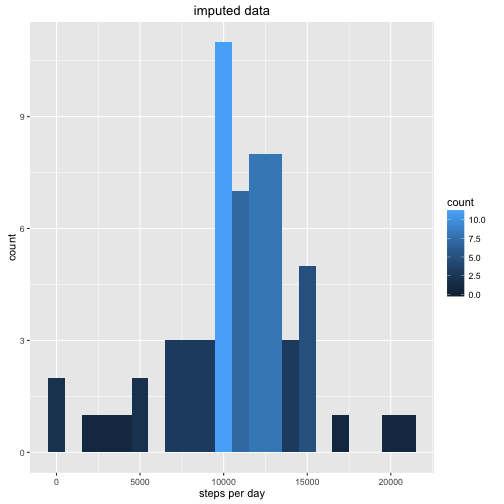
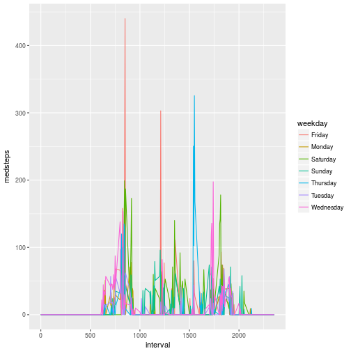

Reproducible Research assignment 1: Daily activity monitoring
==============================================================

Note: Rstudio is being funny. The html was knit from this .Rmd file using the following:

```
library(knitr)
library(markdown)
knit('PA1_template.Rmd')
markdownToHTML('PA1_template.md','PA1_template.html')
```

## Loading and preprocessing the data
load the data here. Load the data from the csv as "data", casting the "date" field as a date class. Do some aggregation, calculate total steps per day and mean steps per interval. 

```r
data<-read.csv('activity.csv')
data$date <- as.Date(data$date)
stepsPerDay<-aggregate(steps~date,data,sum)
stepsPerInterval<-aggregate(steps~interval,data,mean)
```
plot steps taken per day

```r
library(ggplot2)
g<-ggplot(data=stepsPerDay,aes(steps),na.rm=TRUE) 
labels<- labs(x='steps per day')
g+  geom_histogram(fill='green',binwidth=1000) + labels
```


## What is mean total number of steps taken per day?


```r
themean=mean(stepsPerDay$steps)
themedian=median(stepsPerDay$steps)
```

```r
themean
```

```
## [1] 10766.19
```

```r
themedian
```

```
## [1] 10765
```
That's pretty good. My phone says I did 65k steps last week.

## What is the average daily activity pattern?
Want a plot of steps per 5-min interval, averaged over all days
Use the ```aggregate``` function to get this data

```r
g<-ggplot(data=stepsPerInterval,aes(interval,steps,colour='red')) 
labels<- labs(x='interval',y='mean steps per 5 minute interval')
g+  geom_line() + labels
```


Which 5 minute interval, on average, contains the most steps?

```r
stepsPerInterval[which.max(stepsPerInterval$steps),]
```

```
##     interval    steps
## 104      835 206.1698
```
interval 835 (206 steps)


## Imputing missing values

How many missing values are there?

```r
dim(data)
```

```
## [1] 17568     3
```

```r
sum(is.na(data$steps))
```

```
## [1] 2304
```
Quite a bit. How are the missing values distributed by day? Group steps by day, sum the NA values for each group.

```r
suppressMessages(library(dplyr))
missByDay<- data %>% select(date,steps) %>% group_by(date) %>% summarise_each(funs(themiss=sum(is.na(.))))
missByDay %>% filter(themiss > 0)
```

```
## # A tibble: 8 × 2
##         date themiss
##       <date>   <int>
## 1 2012-10-01     288
## 2 2012-10-08     288
## 3 2012-11-01     288
## 4 2012-11-04     288
## 5 2012-11-09     288
## 6 2012-11-10     288
## 7 2012-11-14     288
## 8 2012-11-30     288
```
So for each of these 8 days, the steps data for every interval is missing. That makes life easier, as we're not sampling some intervals more often than others.

Impute things. 


```r
data$weekday <- weekdays(data$date)
stepsPerWeekday<-aggregate(steps~weekday,data,sum)
```
Compute the mean (median?) steps  grouped by weekday  and interval 

```r
data$weekday = weekdays(data$date)
lookup<- data %>% select(steps,weekday,interval) %>% group_by(weekday,interval) %>%
 summarize_each(funs(meansteps=mean(.,na.rm=TRUE),medsteps=median(.,na.rm=TRUE)))
```

plot the mean steps per weekday/interval


```r
g<- ggplot(aes(x=interval,y=meansteps,colour=weekday),data=lookup) + geom_line()
g
```



plot the median


```r
g<- ggplot(aes(x=interval,y=medsteps,colour=weekday),data=lookup) + geom_line()
g
```



## Are there differences in activity patterns between weekdays and weekends?
