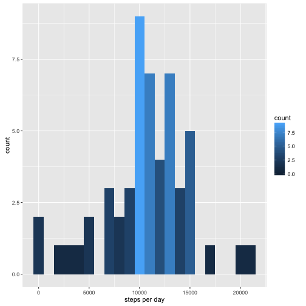

Reproducible Research assignment 1: Daily activity monitoring
==============================================================


Note: Rstudio is being funny. To produce html from this .Rmd file, do the following:
```
library(knitr)
library(markdown)
knit('PA1_template.Rmd')
markdownToHTML('PA1_template.md','PA1_template.html')
```

## Loading and preprocessing the data
load the data here. 

```r
data<-read.csv('activity.csv')
stepsPerDay<-aggregate(steps~date,data,sum)
```
plot steps taken per day

```r
library(ggplot2)
g<-ggplot(data=stepsPerDay,aes(steps)) 
labels<- labs(x='steps per day')
g+  geom_histogram(fill='green') + labels
```

```
## `stat_bin()` using `bins = 30`. Pick better value with `binwidth`.
```




## What is mean total number of steps taken per day?


```r
themean=mean(stepsPerDay$steps)
themedian=median(stepsPerDay$steps)
```

```r
themean
```

```
## [1] 10766.19
```

```r
themedian
```

```
## [1] 10765
```


## What is the average daily activity pattern?


## Imputing missing values


## Are there differences in activity patterns between weekdays and weekends?
